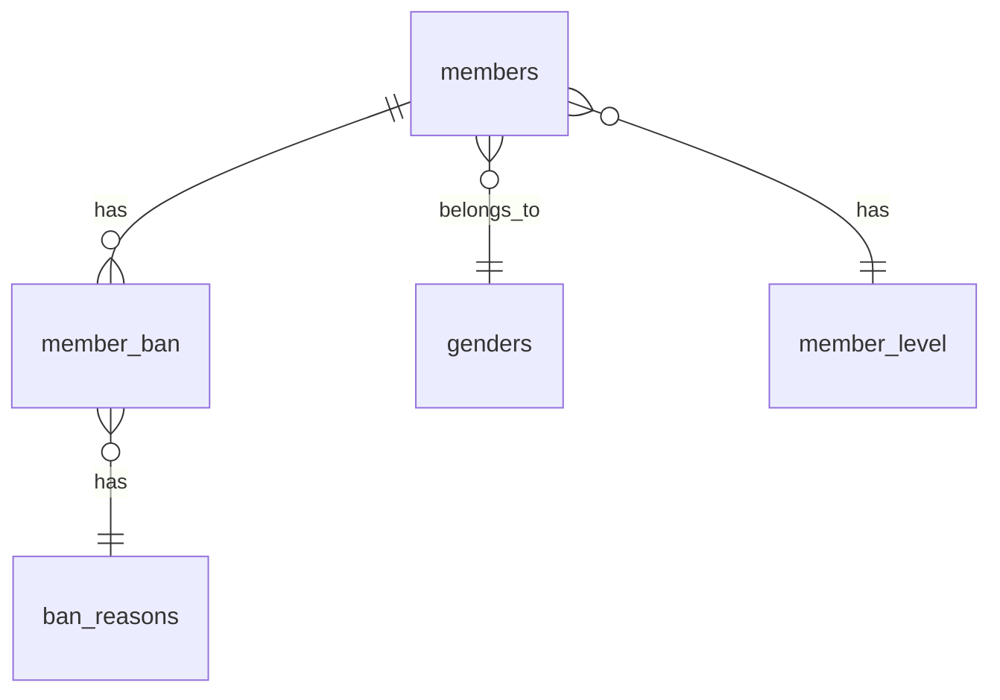

# 🌉 Xin Chào 心橋會員管理系統


一個功能完整的會員管理系統，提供會員註冊、登入、資料管理、封鎖管理等功能。

## 📑 目錄

- [功能特色](#-功能特色)
- [系統需求](#-系統需求)
- [快速開始](#-快速開始)
- [安裝說明](#-安裝說明)
- [使用方法](#-使用方法)
- [API 文檔](#-api-文檔)
- [資料庫結構](#-資料庫結構)
- [安全性](#-安全性)
- [常見問題](#-常見問題)
- [貢獻指南](#-貢獻指南)
- [授權](#-授權)

## ✨ 功能特色

- 🔐 **安全登入系統** - 支援 Session 管理和 ARGON2I 密碼加密
- 👥 **完整會員管理** - CRUD 操作、搜尋、篩選、分頁
- 🚫 **封鎖管理系統** - 會員封鎖/解封，支援多種封鎖原因
- 📊 **等級管理** - 銅、銀、金、鑽四級會員系統
- 📱 **響應式設計** - 支援桌面、平板、手機設備
- 🖼️ **頭像上傳** - 支援圖片上傳和即時預覽
- 📈 **統計功能** - 會員統計數據和圖表展示
- 🔍 **高級搜尋** - 多條件搜尋和日期篩選

## 🔧 系統需求

```
PHP >= 7.4
MySQL >= 5.7
Apache/Nginx
現代瀏覽器支援 (Chrome, Firefox, Safari, Edge)
```

## 🚀 快速開始

### 1. 複製專案

```bash
git clone https://github.com/your-username/xinchao-member-management.git
cd xinchao-member-management
```

### 2. 設定資料庫

```sql
CREATE DATABASE my_db CHARACTER SET utf8mb4 COLLATE utf8mb4_unicode_ci;
```

### 3. 匯入資料庫結構

```bash
mysql -u root -p my_db < u.sql
```

### 4. 設定資料庫連線

編輯 `connect.php`：

```php
$servername = "localhost";
$username = "your_username";
$password = "your_password";
$dbname = "my_db";
$port = 3306;
```

### 5. 設定目錄權限

```bash
chmod 755 img/
chmod 755 images/
```

### 6. 訪問系統

開啟瀏覽器訪問：`http://your-domain/login.php`

## 📦 安裝說明

### 方法一：手動安裝

1. 下載最新版本的原始碼
2. 解壓縮到您的 Web 服務器目錄
3. 按照[快速開始](#-快速開始)的步驟進行設定

### 方法二：使用 Docker（可選）

```bash
# 建立 Docker 容器
docker-compose up -d

# 匯入資料庫
docker exec -i mysql_container mysql -u root -p my_db < u.sql
```

## 🎯 使用方法

### 登入系統

```php
// 預設管理員帳號（請在生產環境中修改）
帳號: admin
密碼: admin123
```

### 會員管理

| 功能 | 說明 | 檔案位置 |
|------|------|----------|
| 會員列表 | 查看所有會員 | `index.php` |
| 新增會員 | 註冊新會員 | `add.php` |
| 查看詳情 | 會員完整資訊 | `view.php` |
| 修改資料 | 編輯會員資訊 | `update.php` |
| 封鎖管理 | 封鎖/解封會員 | `doBan.php` / `doUnban.php` |

### 搜尋和篩選

```php
// 支援的搜尋參數
$_GET['search']     // 搜尋帳號、姓名、Email
$_GET['status']     // 篩選狀態 (active/banned)
$_GET['level']      // 篩選等級 (1-4)
$_GET['start_date'] // 註冊開始日期
$_GET['end_date']   // 註冊結束日期
```

## 📚 API 文檔

### 會員操作

| 動作 | 方法 | 端點 | 說明 |
|------|------|------|------|
| 登入 | POST | `/doLogin.php` | 會員登入驗證 |
| 新增 | POST | `/doAdd.php` | 新增會員 |
| 修改 | POST | `/doUpdate.php` | 修改會員資料 |
| 刪除 | GET | `/doDelete.php?id={id}` | 軟刪除會員 |
| 封鎖 | GET | `/doBan.php?id={id}&reason={reason}` | 封鎖會員 |
| 解封 | GET | `/doUnban.php?id={id}` | 解除封鎖 |

### 回應格式

```javascript
// 成功回應
{
  "status": "success",
  "message": "操作成功",
  "data": {}
}

// 錯誤回應
{
  "status": "error",
  "message": "錯誤訊息",
  "code": "ERROR_CODE"
}
```

## 🗄️ 資料庫結構

### 主要資料表

```sql
-- 會員表
CREATE TABLE members (
    id INT AUTO_INCREMENT PRIMARY KEY,
    account VARCHAR(50) UNIQUE NOT NULL,
    password VARCHAR(255) NOT NULL,
    name VARCHAR(50) NOT NULL,
    email VARCHAR(100) UNIQUE NOT NULL,
    phone VARCHAR(20) NOT NULL,
    gender_id INT NOT NULL,
    birth_date DATE NOT NULL,
    status_id INT NOT NULL,
    avatar VARCHAR(255) DEFAULT 'avatar1.jpg',
    is_valid TINYINT DEFAULT 1,
    created_at TIMESTAMP DEFAULT CURRENT_TIMESTAMP,
    updated_at TIMESTAMP DEFAULT CURRENT_TIMESTAMP ON UPDATE CURRENT_TIMESTAMP
);

-- 封鎖記錄表
CREATE TABLE member_ban (
    id INT AUTO_INCREMENT PRIMARY KEY,
    member_id INT NOT NULL,
    reason_id INT NOT NULL,
    baded_at DATETIME,
    unbaded_at DATETIME,
    FOREIGN KEY (member_id) REFERENCES members(id)
);
```

### ER 圖



## 🔒 安全性

### 密碼安全

- 使用 **ARGON2I** 加密算法
- 密碼長度限制：5-20 字元
- 支援密碼強度檢查

```php
// 密碼加密
$hashedPassword = password_hash($password, PASSWORD_ARGON2I);

// 密碼驗證
password_verify($password, $hashedPassword);
```

### 輸入驗證

```php
// 防止 XSS 攻擊
$account = htmlspecialchars($_POST["account"]);

// 防止 SQL 注入
$stmt = $pdo->prepare("SELECT * FROM members WHERE account = ?");
$stmt->execute([$account]);
```

### 文件上傳安全

```php
// 檔案類型檢查
$allowedTypes = ['image/jpeg', 'image/jpg', 'image/png', 'image/gif'];

// 檔案大小限制
$maxSize = 5 * 1024 * 1024; // 5MB
```

## 🎨 界面展示

### 主要界面

- **登入頁面** - 毛玻璃效果，動態背景
- **會員列表** - 響應式表格，分頁功能
- **會員詳情** - 卡片式設計，資訊豐富
- **新增/編輯** - 表單驗證，即時預覽

### 響應式設計

| 設備 | 寬度 | 說明 |
|------|------|------|
| 桌面 | ≥1200px | 完整功能展示 |
| 平板 | 768px-1199px | 適配中型螢幕 |
| 手機 | <768px | 行動裝置優化 |

## 🔧 設定選項

### 系統設定

```php
// connect.php - 資料庫設定
$servername = "localhost";
$username = "root";
$password = "";
$dbname = "my_db";
$port = 3306;

// 分頁設定
$perPage = 25; // 每頁顯示筆數

// 檔案上傳設定
$maxFileSize = 5 * 1024 * 1024; // 5MB
$allowedTypes = ['image/jpeg', 'image/png', 'image/gif'];
```

### 會員等級設定

| ID | 名稱 | 說明 | 顏色 |
|----|------|------|------|
| 1 | 銅 | 基礎會員 | 藍色 |
| 2 | 銀 | 進階會員 | 灰色 |
| 3 | 金 | 黃金會員 | 金色 |
| 4 | 鑽 | VIP會員 | 特殊色 |

## ❓ 常見問題

<details>
<summary><strong>Q: 無法登入系統怎麼辦？</strong></summary>

**A:** 請檢查以下項目：
1. 資料庫連線設定是否正確
2. 資料庫中是否有管理員帳號
3. 密碼是否正確
4. Session 是否正常啟動

</details>

<details>
<summary><strong>Q: 圖片上傳失敗如何解決？</strong></summary>

**A:** 請確認：
1. `img/` 目錄是否存在且有寫入權限
2. 圖片格式是否支援 (JPG, PNG, GIF)
3. 檔案大小是否超過 5MB 限制
4. PHP 上傳設定是否正確

</details>

<details>
<summary><strong>Q: 如何修改每頁顯示筆數？</strong></summary>

**A:** 編輯 `index.php` 檔案：
```php
$perPage = 50; // 修改為所需的筆數
```

</details>

<details>
<summary><strong>Q: 如何新增封鎖原因？</strong></summary>

**A:** 在資料庫中新增記錄：
```sql
INSERT INTO ban_reasons (name) VALUES ('您的封鎖原因');
```

</details>

## 🤝 貢獻指南

我們歡迎任何形式的貢獻！

### 如何貢獻

1. **Fork** 此專案
2. 建立您的功能分支 (`git checkout -b feature/AmazingFeature`)
3. 提交您的更改 (`git commit -m 'Add some AmazingFeature'`)
4. 推送到分支 (`git push origin feature/AmazingFeature`)
5. 開啟一個 **Pull Request**

### 開發指南

```bash
# 複製開發版本
git clone https://github.com/your-username/xinchao-member-management.git
cd xinchao-member-management

# 建立開發分支
git checkout -b develop

# 安裝依賴（如果有）
composer install

# 執行測試（如果有）
phpunit tests/
```

### 程式碼風格

- 使用 4 個空格縮排
- 遵循 PSR-12 編碼標準
- 添加適當的註釋
- 變數命名使用駝峰命名法

## 📄 更新日誌

### [v1.0.0] - 2025-06-14

#### 新增
- ✨ 完整的會員管理系統
- 🔐 安全的登入驗證機制
- 👥 會員 CRUD 操作
- 🚫 封鎖/解封管理
- 📱 響應式設計界面
- 🖼️ 頭像上傳功能

#### 修復
- 🐛 修復分頁顯示問題
- 🔧 優化資料庫查詢效能
- 🎨 改進用戶界面體驗

## 🛣️ 發展路線

### v1.1.0 (計畫中)
- [ ] 添加會員匯出功能
- [ ] 支援批量操作
- [ ] 添加日誌記錄
- [ ] 優化手機端體驗

### v1.2.0 (未來版本)
- [ ] 支援多語言
- [ ] 添加 API 接口
- [ ] 整合第三方登入
- [ ] 添加會員標籤系統

## 📞 支援

如果您遇到任何問題，請通過以下方式聯繫我們：

- 📧 Email: support@xinchao.com
- 💬 Issue: [GitHub Issues](https://github.com/your-username/xinchao-member-management/issues)
- 📚 Wiki: [專案文檔](https://github.com/your-username/xinchao-member-management/wiki)

## 📝 授權

本專案採用 MIT 授權條款 - 詳見 [LICENSE](LICENSE) 檔案

---

<div align="center">

**[⬆ 回到頂部](#-xin-chào-心橋會員管理系統)**

Made with ❤️ by 前端67-第四組

[](https://github.com/your-username/xinchao-member-management)
[](https://github.com/your-username/xinchao-member-management/fork)

</div>
